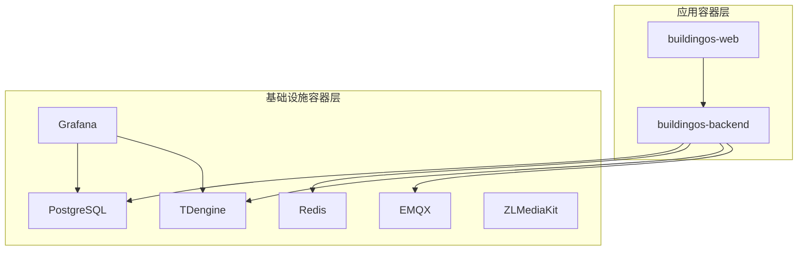
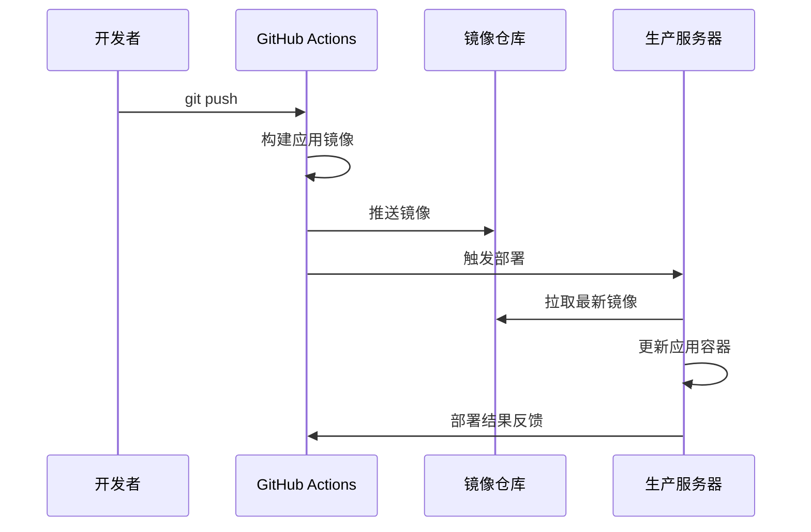

# BuildingOS 分离式部署架构详解

## 🏗️ 架构概述

BuildingOS 采用**分离式容器部署**架构，将系统组件分为两个独立的部署单元：



## 🎯 设计理念

### 分离原则
1. **应用容器**：包含业务逻辑，更新频繁
2. **基础设施容器**：提供数据存储和中间件服务，更新较少

### 核心优势
- ⚡ **快速部署**：应用更新时无需重启基础设施
- 🛡️ **稳定可靠**：基础设施独立运行，不受应用更新影响
- 🔄 **独立扩展**：前后端可独立扩展和版本管理
- 💰 **资源优化**：避免不必要的服务重启和资源浪费

## 📦 容器组织结构

### 应用容器组
```yaml
# docker-compose.app.yml
services:
  buildingos-backend:
    image: ${DOCKER_REGISTRY}/buildingos-backend:${BACKEND_VERSION}
    labels:
      - "app.type=application"
      - "app.service=backend"
  
  buildingos-web:
    image: ${DOCKER_REGISTRY}/buildingos-web:${WEB_VERSION}
    labels:
      - "app.type=application"
      - "app.service=frontend"
```

### 基础设施容器组
```yaml
# docker-compose.infra.yml
services:
  postgres:
    image: ${DOCKER_REGISTRY}/postgres:15-alpine
    labels:
      - "app.type=infrastructure"
      - "app.service=database"
  
  redis:
    image: ${DOCKER_REGISTRY}/redis:7-alpine
    labels:
      - "app.type=infrastructure"
      - "app.service=cache"
```

## 🚀 部署策略

### 1. 首次部署
```bash
# 完整部署所有容器
./deploy.sh
```

**执行流程**：
1. 拉取所有镜像（应用 + 基础设施）
2. 启动基础设施容器
3. 等待基础设施就绪
4. 启动应用容器
5. 执行健康检查

### 2. 应用更新
```bash
# 仅更新应用容器
./deploy.sh --app-only
```

**执行流程**：
1. 拉取最新应用镜像
2. 停止应用容器
3. 启动新版本应用容器
4. 执行健康检查
5. 清理旧镜像

### 3. 基础设施更新
```bash
# 仅更新基础设施
./deploy.sh --infra-only
```

**执行流程**：
1. 备份数据
2. 停止应用容器
3. 更新基础设施容器
4. 恢复数据连接
5. 重启应用容器

## 🔄 CI/CD 集成

### GitHub Actions 工作流

```yaml
# 应用构建（每次代码提交）
build-app-images:
  - 构建 buildingos-backend
  - 构建 buildingos-web
  - 推送到镜像仓库
  - 触发部署

# 基础设施构建（仅当需要时）
build-infrastructure-images:
  - 拉取官方镜像
  - 重新标记为私有仓库
  - 推送到镜像仓库
  - 触发条件：[infra] 标签或 infra- 前缀
```

### 自动化部署流程



## 🏷️ 版本管理策略

### 镜像标签规范
```bash
# 应用镜像
buildingos-backend:v1.2.3    # 语义化版本
buildingos-backend:latest    # 最新版本
buildingos-backend:stable    # 稳定版本

# 基础设施镜像
postgres:15-alpine           # 固定版本
redis:7-alpine              # 主版本固定
```

### 环境变量版本控制
```bash
# 应用版本（频繁更新）
BACKEND_VERSION=v1.2.3
WEB_VERSION=v1.2.1

# 基础设施版本（稳定）
POSTGRES_VERSION=15-alpine
REDIS_VERSION=7-alpine
```

## 🔍 监控和观测

### 容器标签策略
所有容器都添加标准化标签：
```yaml
labels:
  - "app.type=application|infrastructure"
  - "app.service=backend|frontend|database|cache"
  - "app.version=${VERSION}"
  - "app.environment=production"
```

### 监控指标
- **应用容器**：响应时间、错误率、资源使用
- **基础设施容器**：连接数、存储使用、性能指标

## 🛡️ 安全考虑

### 网络隔离
```yaml
networks:
  app-network:
    driver: bridge
    internal: false  # 应用网络可访问外部
  
  infra-network:
    driver: bridge
    internal: true   # 基础设施网络内部隔离
```

### 数据持久化
```yaml
volumes:
  postgres-data:
    driver: local
  redis-data:
    driver: local
  tdengine-data:
    driver: local
```

## 📊 性能优化

### 资源分配
```yaml
# 应用容器
deploy:
  resources:
    limits:
      cpus: '1.0'
      memory: 1G
    reservations:
      cpus: '0.5'
      memory: 512M

# 基础设施容器
deploy:
  resources:
    limits:
      cpus: '2.0'
      memory: 2G
```

### 启动顺序
```yaml
depends_on:
  postgres:
    condition: service_healthy
  redis:
    condition: service_healthy
```

## 🔧 故障恢复

### 自动重启策略
```yaml
restart: unless-stopped
```

### 健康检查
```yaml
healthcheck:
  test: ["CMD", "curl", "-f", "http://localhost:3000/health"]
  interval: 30s
  timeout: 10s
  retries: 3
  start_period: 40s
```

### 回滚机制
```bash
# 快速回滚到上一版本
./deploy.sh --rollback

# 回滚到指定版本
BACKEND_VERSION=v1.2.2 ./deploy.sh --app-only
```

## 📈 扩展策略

### 水平扩展
```yaml
# 应用容器可扩展
deploy:
  replicas: 3
  
# 基础设施容器通常单实例
deploy:
  replicas: 1
```

### 负载均衡
```yaml
# Nginx 配置
upstream backend {
    server buildingos-backend-1:3000;
    server buildingos-backend-2:3000;
    server buildingos-backend-3:3000;
}
```

这种分离式架构确保了 BuildingOS 系统的高可用性、快速部署和运维便利性。