# BuildingOS 部署方案

## 📋 快速开始

### 环境要求
- Docker 20.10+
- Docker Compose 2.0+
- 最小配置：4核CPU，8GB内存，100GB存储

### 一键部署
```bash
# 1. 配置环境变量
cp .env.prod.example .env.prod
vim .env.prod

# 2. 执行部署
chmod +x ../../scripts/deploy.sh
../../scripts/deploy.sh production v1.0.0
```

## 🐳 镜像管理策略

### 推荐方案：阿里云容器镜像服务
```bash
# 镜像命名规范
registry.cn-hangzhou.aliyuncs.com/buildingos/buildingos-backend:v1.0.0
registry.cn-hangzhou.aliyuncs.com/buildingos/buildingos-web:v1.0.0
```

### 为什么使用镜像仓库而不是直接拷贝？

| 对比项 | 镜像仓库 | 文件拷贝 |
|--------|----------|----------|
| **版本管理** | ✅ 自动标签管理 | ❌ 手动管理，易混乱 |
| **传输效率** | ✅ 增量传输，层缓存 | ❌ 完整文件，传输慢 |
| **安全性** | ✅ 认证授权，漏洞扫描 | ❌ 文件传输，安全风险 |
| **自动化** | ✅ CI/CD 集成 | ❌ 手动操作，容易出错 |
| **回滚能力** | ✅ 一键回滚到任意版本 | ❌ 手动恢复，复杂 |

## 🚀 部署流程

### 方案一：自动化部署（推荐）

```mermaid
graph LR
    A[代码提交] --> B[GitHub Actions]
    B --> C[构建镜像]
    C --> D[推送仓库]
    D --> E[自动部署]
    E --> F[健康检查]
```


**操作步骤：**
```bash
# 1. 开发完成，提交代码
git add .
git commit -m "feat: 新功能"
git push origin develop

# 2. 创建发布版本
git checkout main
git merge develop
git tag v1.1.0
git push origin v1.1.0

# 3. 自动部署完成 🎉
```

### 方案二：手动部署
```bash
# 在服务器执行
cd /opt/buildingos
./scripts/deploy.sh production v1.1.0
```

## 📁 文件说明

### 配置文件
- `docker-compose.prod.yml` - 生产环境服务配置
- `.env.prod` - 环境变量配置
- `README.md` - 本说明文档

### 环境变量配置
```bash
# 镜像仓库配置
DOCKER_REGISTRY=registry.cn-hangzhou.aliyuncs.com/buildingos
VERSION=v1.0.0

# 数据库密码
DB_PASSWORD=your_secure_password
REDIS_PASSWORD=your_redis_password
GRAFANA_PASSWORD=your_grafana_password
```

## 🔄 更新部署

### 日常更新流程
1. **开发阶段**：本地开发 → 提交代码
2. **构建阶段**：CI/CD 自动构建镜像 → 推送到仓库
3. **部署阶段**：服务器拉取镜像 → 更新服务
4. **验证阶段**：健康检查 → 监控告警

### 快速更新命令
```bash
# 更新到指定版本
./scripts/deploy.sh production v1.2.0

# 回滚到上一版本
./scripts/deploy.sh production v1.1.0
```

## 🛠️ 运维管理

### 服务状态检查
```bash
# 查看所有服务状态
docker-compose -f docker-compose.prod.yml ps

# 查看服务日志
docker-compose -f docker-compose.prod.yml logs -f [service_name]

# 重启特定服务
docker-compose -f docker-compose.prod.yml restart [service_name]
```

### 数据备份
```bash
# 执行完整备份
../../scripts/backup.sh full

# 执行增量备份
../../scripts/backup.sh incremental
```

### 监控访问
- **应用访问**：http://your-server
- **Grafana 监控**：http://your-server:3000
- **TDengine 管理**：http://your-server:6060

## 🔒 安全配置

### 防火墙设置
```bash
# 开放必要端口
ufw allow 22/tcp    # SSH
ufw allow 80/tcp    # HTTP
ufw allow 443/tcp   # HTTPS
ufw allow 3000/tcp  # Grafana
ufw enable
```

### SSL 证书
```bash
# 生成自签名证书（测试用）
cd ../ssl-certs
./generate-certs.sh

# 生产环境建议使用 Let's Encrypt
certbot --nginx -d your-domain.com
```

## 🚨 故障排除

### 常见问题

**1. 容器启动失败**
```bash
# 查看详细日志
docker logs [container_name] --details

# 检查资源使用
docker stats
```

**2. 数据库连接失败**
```bash
# 检查网络连接
docker network inspect buildingos-network

# 测试数据库连接
docker exec -it buildingos-postgres psql -U buildingos -d buildingos
```

**3. 镜像拉取失败**
```bash
# 检查镜像仓库认证
docker login registry.cn-hangzhou.aliyuncs.com

# 手动拉取测试
docker pull registry.cn-hangzhou.aliyuncs.com/buildingos/buildingos-backend:latest
```

### 应急处理
- **服务异常**：立即回滚 `./scripts/deploy.sh production [previous_version]`
- **数据问题**：从备份恢复 `./scripts/restore.sh [backup_date]`
- **性能问题**：扩容资源或横向扩展

## 📞 技术支持

- **部署问题**：查看 `../../docs/DEPLOYMENT_GUIDE.md` 详细文档
- **CI/CD 配置**：参考 `../../.github/workflows/ci-cd.yml`
- **脚本使用**：查看 `../../scripts/` 目录下的脚本文件

---

**最后更新**：2024年1月  
**适用版本**：BuildingOS v1.0.0+